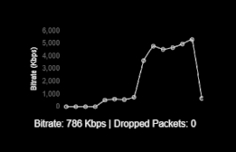

# BELABOX Cloud Stats Overlay for OBS
This project provides a customizable HTML overlay for OBS that displays real-time streaming statistics from BELABOX Cloud. The overlay can show bitrate, RTT (Round Trip Time), dropped packets, and a optional dynamic bitrate graph. Ideal for showing on your IRL live stream or showing a brief history of bitrate on your "LOW" connection scene.

## Features

- **Real-time Bitrate Display**: Monitor the current bitrate of your stream.
- **Optional RTT and Dropped Packets Display**: Display additional stats such as RTT and dropped packets.
- **Dynamic Bitrate Graph**: A small, real-time graph of the bitrate over time.
- **Configurable Refresh Interval**: Set how often the stats update.
- Supports both stats formats from Belabox Cloud, the global stats URLs and individual locations. e.g. uk. eu. use. 
  
## Usage

To use this overlay, add the `bitrate_overlay.html` file as a browser source in OBS. Download the file and save it somewhere on your PC. Adjust the file path below to match the location of the downloaded file. You can customize the overlay using query parameters.

### Example URL (basic bitrate display)
Replace [belabox cloud stats url] with your actual full URL of the BELABOX Cloud stats, found in your account.

`file:///C:/path/to/bitrate_overlay.html?stats_url=[belabox cloud stats url]`

### Example URL (graph and stats display)
Replace [belabox cloud stats url] with your actual full URL of the BELABOX Cloud stats, found in your account.

`file:///C:/path/to/bitrate_overlay.html?stats_url=[belabox cloud stats url]&refresh_interval=5&show_rtt=true&advanced_stats=true`

## Query Parameters

| Parameter           | Type    | Description                                                                 | Default     |
|---------------------|---------|-----------------------------------------------------------------------------|-------------|
| `stats_url`         | String  | **Required.** The URL to the BELABOX API endpoint for fetching stats.        | None        |
| `refresh_interval`  | Integer | Optional. The refresh interval in seconds for updating the stats.            | `5`         |
| `show_rtt`          | Boolean | Optional. Set to `true` to display RTT (Round Trip Time) in milliseconds.    | `false`     |
| `advanced_stats`    | Boolean | Optional. Set to `true` to display a small bitrate graph and dropped packets.| `false`     |

## How it looks in OBS with the graph enabled

